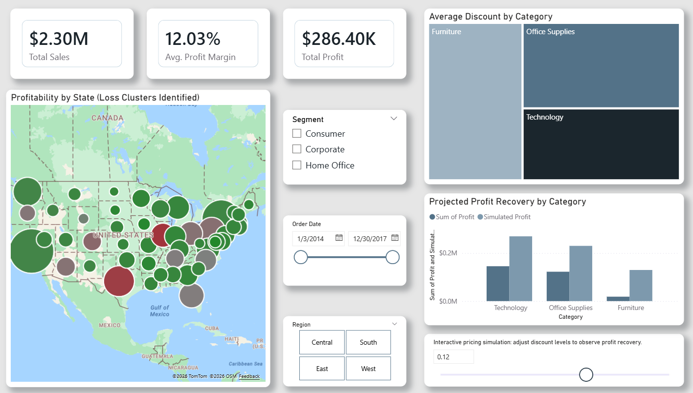

# Retail Profitability Intelligence
### An Evidence-Driven Case Study in Strategic Business Analytics


---

## Project Documentation
For a comprehensive deep dive into the diagnostic logic, business context, and strategic recommendations, please refer to the official report:
* **[Professional Case Study (PDF)](./docs/retail_profitability_case_study_luis_moto.pdf)**

---

## Executive Summary
In multi-regional retail environments, overall positive performance often masks localized operational inefficiencies. This project analyzes the operational and financial performance of a global retail dataset comprising approximately 10,000 transactions. 

The objective was to move beyond descriptive analytics into **decision-oriented business intelligence**, identifying the **key operational variables**—pricing thresholds, aggressive discounting, or sub-category mismanagement—that erode net profit, and transforming raw transactional records into actionable insights for decision-makers.

---

## Dashboard Preview

*Interactive Power BI environment for regional margin monitoring and what-if simulation.*

---

## Business Impact
- **Hidden Loss Detection:** Identified a critical regional loss center generating over $170K in sales but operating at a negative margin (-34.20%).
- **Pricing Guardrails:** Defined a specific discount threshold (20%) to prevent margin deterioration across key product categories.
- **Profit Recovery:** Simulated corrective pricing actions capable of recovering **+$9.05K** in net profit in underperforming segments.
- **Strategic Tooling:** Delivered an interactive executive dashboard for multidimensional scenario analysis and data-driven decision-making.

---

## Core Business Questions
The diagnostic analysis was designed to answer:
- Which geographies generate high revenue but fail to maintain sustainable profit margins?
- At what **discount range** do promotional strategies begin to erode profitability?
- How do fulfillment delays impact the effective contribution margin of low-margin inventory?
- What targeted operational adjustments can improve financial health without sacrificing market share?

---

## Key Strategic Findings
- **The Texas Outlier:** Discovered that despite high sales volume, Texas yielded a -$25.73K loss, highlighting a fundamental breakdown in pricing strategy.
- **The Discount Trap:** Analysis confirmed that in *Office Supplies* and *Furniture*, discounts exceeding the 20% mark trigger **accelerated margin decay**.
- **Simulation Insights:** A targeted 5% reduction in aggressive discounts was modeled to show a potential **26.6% improvement** in regional performance.

---

## Tech Stack
| Category | Tools / Methods |
|---|---|
| **Data Engineering** | Python, Pandas, NumPy |
| **Exploratory Analysis** | Jupyter Notebook, Matplotlib |
| **Business Intelligence** | Power BI, DAX |
| **Methodology** | Root Cause Analysis (RCA), Trend Analysis, What-If Simulation |
| **Deliverables** | Professional Case Study, Executive Dashboard |

---

## Project Architecture
```bash
├── Dashboard/
│   └── projected_profit_recovery_by_category.pbix
│
├── Notebooks/
│   ├── 01_data_exploration.ipynb
│   └── images/
│       └── projects/
│           ├── discount_vs_profit.png
│           └── super_dash.png
│
├── data/
│   ├── raw/
│   │   └── Sample - Superstore.csv
│   └── processed/
│       └── Superstore_Clean.csv
│
├── docs/
│   └── retail_profitability_case_study_luis_moto.pdf
│
└── README.md